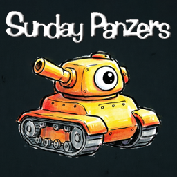

# Sunday Panzers


**Sunday Panzers** is a 3D tank combat game: The second of "Sunday" series, this time you've to smash tanks in a funny and chaotic battle. 50 levels, 8 different tanks, 10 squads to unlock and 6 scenarios, plus powerups and more. Control a max of 12 tanks versus 28 enemy tanks and 5 guest tanks! Have fun! The project is file by file and with source code.

This repository contains a modern open-source reimplementation of the original
freeware game *Sunday Panzers* (2004) by **Bertone Ermes (Ermesdesign)**,
originally written in DarkBASIC Pro.

## Original game

|                     |                                                       |
|---------------------|-------------------------------------------------------|
| Author              | Bertone Ermes (Ermesdesign)                           |
| Year                | 2004                                                  |
| Original language   | DarkBASIC Pro                                         |
| Original source     | `sunday_panzers.dba`, Version 1.2 08-12-2004          |
| Website             | http://xoomer.virgilio.it/ermesjr (not available)     |
| E-mail              | ermesjr@libero.it (not available)                     |

The original game was released as freeware. All credits for the game design,
artwork and sounds belong to the original author.

## This reimplementation

|                     |                                                       |
|---------------------|-------------------------------------------------------|
| Language            | C++17                                                 |
| Framework           | [raylib](https://www.raylib.com/)                     |
| Platforms           | Windows (x86_64), Nintendo Switch (homebrew)          |
| Build system        | GNU Make                                              |

### Technologies & tools

- [raylib](https://www.raylib.com/) — simple and easy-to-use library for game development (zlib license)
- [raylib-nx](https://github.com/luizpestana/raylib-nx) — Nintendo Switch port of the raylib by Luiz Pestana (zlib license)
- [devkitPro](https://devkitpro.org/) (devkitA64 + libnx) — Nintendo Switch homebrew toolchain
- [MinGW-w64](https://www.mingw-w64.org/) — Windows cross-compilation
- [nlohmann/json](https://github.com/nlohmann/json) — JSON for settings, game data and saves (MIT)
- [Docker / devcontainer](https://www.docker.com/) — reproducible build environment
- [GNU Make](https://www.gnu.org) — build automation

## Features

- 50 campaign levels with scaling AI difficulty
- 10 squads and 8 tank types; squad constructor with credit-based buying
- Real-time commander switching between your tanks
- 6 biomes: grass country, mountains, desert, frozen country, tundra, the Moon
- Power-ups, turbo mode, destructible trees
- Keyboard & mouse, gamepad and touch-screen controls
- Progress saving and a final ending after completing level 50

## Building

### Windows

```bash
make win
# run: ./build/win/sunday_panzers.exe
```

### Nintendo Switch

```bash
make switch
# copy contents of build/switch/ to sdmc:/switch/SundayPanzers/
```

## License

- **Port source code** (`source/`) is licensed under the [MIT License](LICENSE).
- **Original game** (concept, design, graphics, sounds) © 2004 Bertone Ermes
  (Ermesdesign), originally released as freeware. 
- **This project** is a fan-made reimplementation made for educational purposes; all rights to the original intellectual property remain with the author.